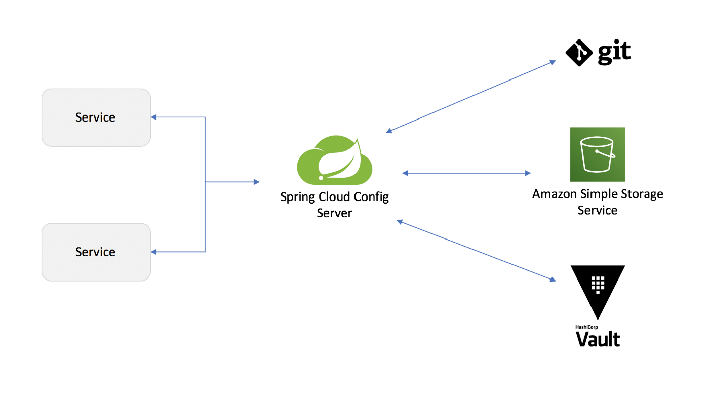
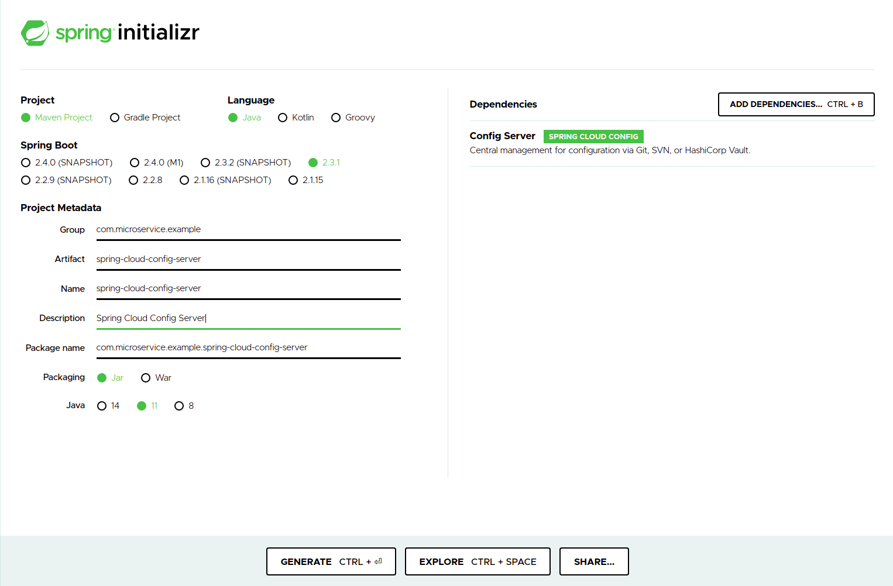
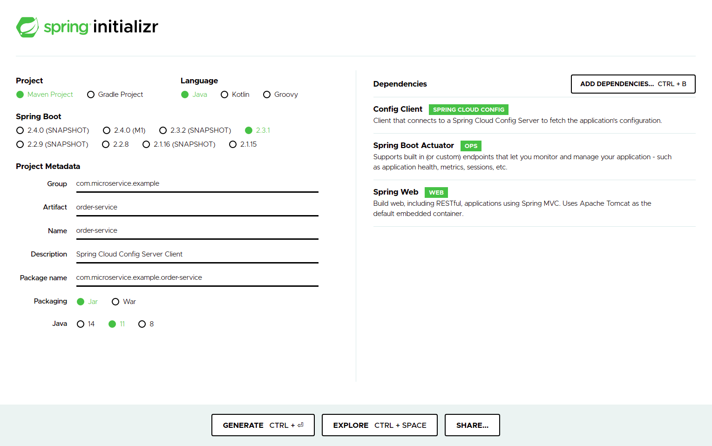

### Spring Cloud Config Server

Spring Cloud Config is Spring's client/server approach for storing and serving distributed configurations across multiple applications and environments.

- http://localhost:8888/limits-service/default
- http://localhost:8888/limits-service/dev
- http://localhost:8888/limits-service/qa


- http://localhost:8080/limits





## Spring Cloud Config Server
For all Spring applications, you should start with the Spring Initializr. The Initializr offers a fast way to pull in all the dependencies you need for an application and does a lot of the set up for you.

This guide needs two applications. The first application (the configuration service) needs only the Config Server dependency. The following image shows the Initializr set up for the configuration service:


I created a maven project.  You should care that we just add config server dependencies.

pom.xml
```json
<dependencies>
    <dependency>
        <groupId>org.springframework.cloud</groupId>
        <artifactId>spring-cloud-config-server</artifactId>
    </dependency>

    ***
</dependencies>
```

In addition to the application name, we also put the active profile and the connection-details in our bootstrap.properties:
```json
/{application}/{profile}[/{label}]
/{application}-{profile}.yml
/{label}/{application}-{profile}.yml
/{application}-{profile}.properties
/{label}/{application}-{profile}.properties
```

######  I added in the below repository some application properties file for prod, dev and default profile.  
https://github.com/MehmetAlpGuler/spring-cloud-config-server-properties.git


application.properties
```json
spring.application.name=spring-cloud-config-server
server.port=8888
spring.cloud.config.server.git.uri=https://github.com/MehmetAlpGuler/spring-cloud-config-server-properties.git
```
---
###### @EnableConfigServer 
You first need a Config Service to act as a sort of intermediary between your Spring applications and a (typically) version-controlled repository of configuration files. You can use Spring Cloud’s @EnableConfigServer to standup a config server that can communicate with other applications. This is a regular Spring Boot application with one annotation added to enable the config server.
SpringCloudConfigServerApplication.java
```json
@EnableConfigServer //just this annotation added for spring cloud config server
@SpringBootApplication
public class SpringCloudConfigServerApplication {

	public static void main(String[] args) {
		SpringApplication.run(SpringCloudConfigServerApplication.class, args);
	}

}
```


## Spring Cloud Config Client Microservice
###limits-service
The second application (the configuration client) needs the Config Client, Spring Boot Actuator, and Spring Web dependencies. The following image shows the Initializr set up for the configuration client:



The following listing shows the pom.xml file dependencies (for the configuration client) that were created when you choose Maven:

pom.xml
```json
<dependencies>

    <dependency>
        <groupId>org.springframework.boot</groupId>
        <artifactId>spring-boot-starter-actuator</artifactId>
    </dependency>

    <dependency>
        <groupId>org.springframework.boot</groupId>
        <artifactId>spring-boot-starter-web</artifactId>
    </dependency>

    <dependency>
        <groupId>org.springframework.cloud</groupId>
        <artifactId>spring-cloud-starter-config</artifactId>
    </dependency>

    ***
</dependencies>
```

bootstrap.properties
```json
spring.application.name=limits-service
spring.cloud.config.uri=http://localhost:8888
spring.profiles.active=dev
management.security.enabled=false
```

 
  

----
###### Also The below link can help for Encryption and Decryption
https://bit.ly/3e1R86R